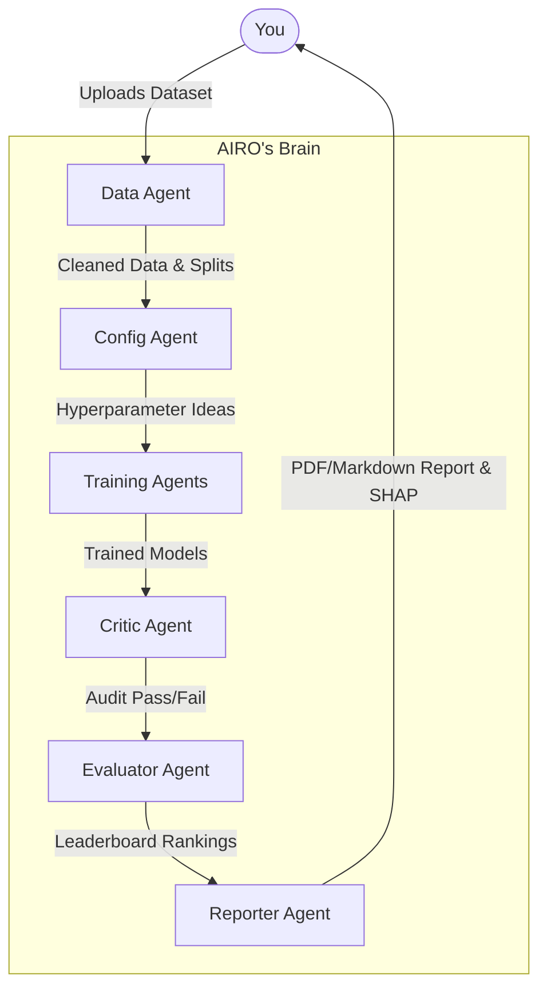

# Meet AIRO — Your AI Research Orchestrator

> **"Hello, I'm AIRO. I'm a multi-agent system that works like a Senior Data Science team. Give me a dataset, and my specialized agents will clean it, design an experiment, train dozens of models in parallel, audit them for issues, and hand you a production-ready PDF report."**

AIRO automates the entire machine learning experimentation workflow using an orchestration of **six autonomous agents** that coordinate end-to-end — from raw data to a polished, reproducible report — with no paid API required.

---

## 🌐 Live Production Deployment
- **Frontend Dashboard:** [https://airo-frontend-app.vercel.app/](https://airo-frontend-app.vercel.app/)
- **Backend API (Swagger UI):** [https://airo-ai-research-orchestrator.onrender.com/docs](https://airo-ai-research-orchestrator.onrender.com/docs)

---

## Architecture

I use **LangGraph** to coordinate it. Here is how we work together when you upload a dataset:



### The Agents & Their Roles
1. **Data Agent:** "I ingest, validate, and cleanse your data. Missing values? Gone. Categoricals? Encoded. Then I create stratified train/val/test splits."
2. **Config Agent:** "I brainstorm the best architectures and hyperparameters for your specific problem using Groq LLaMA models. I think outside the box."
3. **Training Agents:** "We spin up a ThreadPoolExecutor and train all those configs in parallel. Heavy lifting is our specialty."
4. **Critic Agent:** "I audit every model. Overfitting? Data leakage? Suspicious metrics? I'll find it, flag it, and fail the model before it reaches production."
5. **Evaluator Agent:** "I rank the surviving models on a leaderboard and calculate exactly how much better we did than a naive baseline."
6. **Reporter Agent:** "I compile the entire experiment into a beautiful PDF and Markdown report, exporting raw metrics for horizontal SHAP feature importance and learning curves."

### 🌟 Technical Highlights & Engineering Depth
To demonstrate production-grade MLOps and software engineering standards, the following architectural upgrades are implemented:
- **Leak-Free Preprocessing:** Imputation, standard scaling, and ordinal encoding are fitted strictly on the training split and transformed on the validation/test splits, mathematically eliminating standard ML data leakage.
- **Isolated Concurrent Logging:** Uses thread-safe dynamic Loguru sinks combined with ContextVar copying across ThreadPoolExecutor workers to route outputs to individual files (`logs/airo_{experiment_id}.log`), preventing interleaved log streams when multiple experiments run concurrently.
- **MLflow Native Model Logging:** Registers models natively using `mlflow.xgboost.log_model` or `mlflow.sklearn.log_model` with automatic python environment pinning and schema signature inference.
- **Interactive Visualizations:** Upgraded static Matplotlib `.png` generation by exporting raw metric JSON files and rendering them dynamically on the frontend via interactive, client-side **Recharts** canvas blocks.

---

## 📂 File Structure

Here is how the project is organized under the hood:

```text
AIRO/
├── orchestrator/           # LangGraph orchestration and state management
│   ├── graph.py            # The StateGraph routing logic 
│   ├── router.py           # Conditional routing (error handling & retries)
│   ├── runner.py           # The CLI entrypoint
│   └── state.py            # AIROState — shared memory across all agents
│
├── agents/                 # Autonomous agent implementations
│   ├── data_agent.py       
│   ├── config_agent.py     
│   ├── training_agent.py   
│   ├── critic_agent.py     
│   ├── evaluator_agent.py  
│   └── reporter_agent.py   
│
├── tools/                  # Utility functions and API wrappers
│   ├── data_tools.py       # Pandas wrangling, Scikit-learn encoding, DVC
│   ├── llm_tools.py        # Groq API wrappers with retry mechanisms
│   ├── metrics_tools.py    # Unified metric calculation
│   ├── mlflow_tools.py     # SQLite DB tracking for run management
│   ├── shap_tools.py       # Explainability and feature importance plotting
│   └── report_tools.py     # Jinja2 templating → Custom PDF rendering
│
├── api/                    # FastAPI backend endpoints
│   └── main.py             # Server bridging LangGraph and frontend
│
├── airo-frontend/          # Next.js 14 App Router frontend
│   ├── app/                # Pages (Dashboard, Run, Trace, Leaderboard, Report)
│   ├── components/         # React components (Zustand, Tailwind, Shadcn UI)
│   └── store/              # Zustand global state for SSE and experiments
│
├── data/                   # Dataset storage
│   ├── raw/                # Drop datasets here
│   ├── processed/          # Cleaned, DVC-hashed artifacts
│   └── splits/             # Train / val / test parquet files
│
├── reports/                # Final generated Markdown and PDF reports
├── models/                 # Serialized .pkl weights from top models
└── tests/                  # Automated Pytest test suites
```

---

## 🚀 Quickstart

Ready to put me to work? It's easy!

### 1. Clone & Install
```bash
git clone https://github.com/moiz-mansoori/AIRO
cd AIRO
pip install -r requirements.txt

# Install frontend dependencies
cd airo-frontend
npm install
cd ..
```

### 2. Give Me a Brain (Free Groq API Key)
Copy the example environment file and insert your API key:
```bash
cp .env.example .env
```
*(Get your free key at **console.groq.com** — no credit card required, 14,400 req/day free).*

### 3. Talk to Me (Run an Experiment)
From the CLI:
```bash
# A super fast test run (trains 3 models, skips learning curves — ~2 mins)
python -m orchestrator.runner --dataset data/raw/diabetes.csv --task classification --target Outcome --budget fast

# A standard exhaustive run (trains 6 models — ~5-8 mins)
python -m orchestrator.runner --dataset data/raw/diabetes.csv --task classification --target Outcome
```

### 4. Open My Dashboard
Launch the FastAPI backend and Next.js frontend:

Terminal 1 (Backend):
```bash
python -m uvicorn api.main:app --port 8000
```

Terminal 2 (Frontend):
```bash
cd airo-frontend
npm run dev
```
Open your browser to `http://localhost:3000` (or 3001 if occupied).

### 5. View experiment tracking (MLflow UI)
```bash
# No server needed — just point MLflow at the SQLite database
mlflow ui --backend-store-uri sqlite:///mlruns.db
# Then open: http://localhost:5000
```

---

## ⚡ Performance Tuning

I run fast by default. But if you're impatient or running on a lower-end machine, you can tweak my `.env` file settings:

| What to change | Where | Effect |
|---|---|---|
| `--budget fast` | CLI command | Computes 3 configs instead of 6 |
| `AIRO_SKIP_CURVES=true` | `.env` file | Skip complex learning curves (~60% faster runtime) |
| `AIRO_SKIP_SHAP=true` | `.env` file | Skip SHAP feature importance plots |
| `AIRO_PARALLEL_WORKERS=2` | `.env` file | Reduce the ThreadPool worker count if RAM is limited |

---

## LLM Configuration Options

I don't require expensive APIs. You can power my reasoning engine with any of these **100% free** options:

### Groq (Recommended — Incredible Speed)
```env
GROQ_API_KEY=gsk_...
AIRO_MODEL=llama-3.3-70b-versatile
```

### Google Gemini
```bash
pip install langchain-google-genai google-generativeai
```
```env
GEMINI_API_KEY=your_key_here
AIRO_MODEL=gemini-1.5-flash
```

### Ollama (Fully Local & Offline)
```bash
ollama pull llama3.2
pip install langchain-ollama
```
```env
AIRO_MODEL=llama3.2
OLLAMA_BASE_URL=http://localhost:11434
```

---

## Tech Stack

I am built entirely on modern, production-ready developer tooling:

*   **Brain / Orchestration:** LangGraph 0.2+
*   **Reasoning Engine:** Groq (LLaMA 3.3 70B via API)
*   **Memory / Tracking:** MLflow (SQLite Backend, Native Model Registry)
*   **Model Building:** Scikit-learn, XGBoost
*   **Backend API:** FastAPI
*   **Frontend UI:** Next.js 16 (App Router), Tailwind CSS v4, Recharts, Framer Motion, Zustand
*   **Explainability:** SHAP (JSON metrics payload)
*   **Report Generation:** Jinja2 & WeasyPrint (Markdown / PDF formatting)
*   **Testing:** Pytest & Pytest-Mock

---

## 🐛 Troubleshooting

**How do I view MLflow runs?**
→ Run `mlflow ui --backend-store-uri sqlite:///mlruns.db` from the project root. Open http://localhost:5000 in your browser. No server setup required — the SQLite file is created automatically.

**Why are all my models getting a WARN verdict from the Critic Agent?**
→ The Critic agent consistently detects overfitting on small datasets — a known limitation of tree-based models on 768-row tabular data without regularization tuning. This is intended ML behavior, not a bug!

---

**Feel free to clone, use, and collaborate! Pull requests are always welcome.** 
