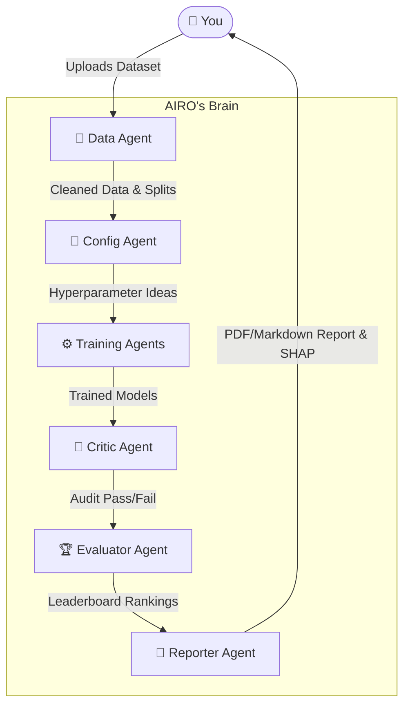

# 🤖 Meet AIRO — Your AI Research Orchestrator

> **"Hi, I'm AIRO. I'm a multi-agent system that works like a Senior Data Science team. Give me a dataset, and my specialized agents will clean it, design an experiment, train dozens of models in parallel, audit them for issues, and hand you a production-ready PDF report."**

AIRO automates the entire machine learning experimentation workflow using an orchestration of **six humanoid-inspired agents** that coordinate end-to-end — from raw data to a polished, reproducible report — with no paid API required.

---

## 🧠 Meet The Team (Architecture)

I use **LangGraph** to coordinate it. Here is how we work together when you upload a dataset:



### The Agents & Their Roles
1. 🧹 **Data Agent (The Cleaner):** "I ingest, validate, and cleanse your data. Missing values? Gone. Categoricals? Encoded. Then I create stratified train/val/test splits."
2. 🧠 **Config Agent (The Architect):** "I brainstorm the best architectures and hyperparameters for your specific problem using Groq LLaMA models. I think outside the box."
3. ⚙️ **Training Agents (The Engine):** "We spin up a ThreadPoolExecutor and train all those configs in parallel. Heavy lifting is our specialty."
4. 🧐 **Critic Agent (The Reviewer):** "I audit every model. Overfitting? Data leakage? Suspicious metrics? I'll find it, flag it, and fail the model before it reaches production."
5. 🏆 **Evaluator Agent (The Judge):** "I rank the surviving models on a leaderboard and calculate exactly how much better we did than a naive baseline."
6. 📄 **Reporter Agent (The Analyst):** "I compile the entire experiment into a beautiful PDF and Markdown report, complete with SHAP explainability plots and executive recommendations."

---

## 📂 Inside My Brain (File Structure)

Here is how my mind is organized under the hood:

```text
AIRO/
├── orchestrator/           # 🧠 My Central Nervous System (LangGraph)
│   ├── graph.py            # The StateGraph routing logic connecting my agents
│   ├── router.py           # Conditional routing (error handling & retries)
│   ├── runner.py           # The CLI entrypoint (how you talk to me)
│   └── state.py            # AIROState — my shared memory across all agents
│
├── agents/                 # 🤖 My Specialized Team
│   ├── data_agent.py       # (🧹 The Cleaner)
│   ├── config_agent.py     # (🧠 The Architect - generates configurations)
│   ├── training_agent.py   # (⚙️ The Engine - parallel model fitting)
│   ├── critic_agent.py     # (🧐 The Reviewer - algorithmic auditing)
│   ├── evaluator_agent.py  # (🏆 The Judge - baseline comparison & ranking)
│   └── reporter_agent.py   # (📄 The Analyst - Markdown/PDF writing)
│
├── tools/                  # 🛠️ My Utility Belt
│   ├── data_tools.py       # Pandas wrangling, Scikit-learn encoding, DVC versioning
│   ├── llm_tools.py        # Groq API wrappers with retry mechanisms
│   ├── metrics_tools.py    # Unified metric calculation (classification & regression)
│   ├── mlflow_tools.py     # SQLite DB tracking for run management
│   ├── shap_tools.py       # Explainability and feature importance plotting
│   └── report_tools.py     # Jinja2 templating → Custom PDF rendering
│
├── frontend/               # 🖥️ My Face (The UI)
│   ├── app.py              # Streamlit Multi-Page dashboard entry point
│   ├── components/         # Shared UI pieces (Theme CSS, Sidebar)
│   └── pages/              # Run Exp, Live Trace, Leaderboard, Report Viewer
│
├── data/                   # 💾 Where I store your files
│   ├── raw/                # Drop datasets here
│   ├── processed/          # My cleaned, DVC-hashed artifacts
│   └── splits/             # Train / val / test parquet files
│
├── reports/                # 📊 Output directory (Your final PDFs and Logs)
├── models/                 # ⚙️ Saved .pkl weights from winning experiments
└── tests/                  # 🧪 Automated test suites covering my logic
```

---

## 🚀 Quickstart

Ready to put me to work? It's easy!

### 1. Clone & Install
```bash
git clone https://github.com/moiz-mansoori/AIRO
cd AIRO
pip install -r requirements.txt
```

### 2. Give Me a Brain (Free Groq API Key)
Copy the example environment file and insert your API key:
```bash
cp .env.example .env
```
*(Get your free key at **console.groq.com** — no credit card required, 14,400 req/day free).*

### 3. Talk to Me (Run an Experiment)
From the CLI:
```bash
# A super fast test run (trains 3 models, skips learning curves — ~2 mins)
python -m orchestrator.runner --dataset data/raw/diabetes.csv --task classification --target Outcome --budget fast

# A standard exhaustive run (trains 6 models — ~5-8 mins)
python -m orchestrator.runner --dataset data/raw/diabetes.csv --task classification --target Outcome
```

### 4. Open My Dashboard
Prefer a UI? Launch my Streamlit dashboard:
```bash
streamlit run frontend/app.py
```

---

## ⚡ Make Me Faster

I run fast by default. But if you're impatient or running on a lower-end machine, you can tweak my `.env` file settings:

| What to change | Where | Effect |
|---|---|---|
| `--budget fast` | CLI command | Computes 3 configs instead of 6 |
| `AIRO_SKIP_CURVES=true` | `.env` file | Skip complex learning curves (~60% faster runtime) |
| `AIRO_SKIP_SHAP=true` | `.env` file | Skip SHAP feature importance plots |
| `AIRO_PARALLEL_WORKERS=2` | `.env` file | Reduce the ThreadPool worker count if RAM is limited |

---

## 🆓 Free LLM Options

I don't require expensive APIs. You can power my reasoning engine with any of these **100% free** options:

### Groq (Recommended — Incredible Speed)
```env
GROQ_API_KEY=gsk_...
AIRO_MODEL=llama-3.3-70b-versatile
```

### Google Gemini
```bash
pip install langchain-google-genai google-generativeai
```
```env
GEMINI_API_KEY=your_key_here
AIRO_MODEL=gemini-1.5-flash
```

### Ollama (Fully Local & Offline)
```bash
ollama pull llama3.2
pip install langchain-ollama
```
```env
AIRO_MODEL=llama3.2
OLLAMA_BASE_URL=http://localhost:11434
```

---

## 🛠️ My Tech Stack

I am built entirely on modern, production-ready python tooling:

*   **Brain / Orchestration:** LangGraph 0.2+
*   **Reasoning Engine:** Groq (LLaMA 3.3 70B via API)
*   **Memory / Tracking:** MLflow (SQLite Backend)
*   **Model Building:** Scikit-learn, XGBoost
*   **Interface / Face:** Streamlit (Dark UI Theme)
*   **Explainability:** SHAP
*   **Report Generation:** Jinja2 & WeasyPrint
*   **Testing:** Pytest & Pytest-Mock

---

**Feel free to clone, use, and collaborate! Pull requests are always welcome.** 🤝
